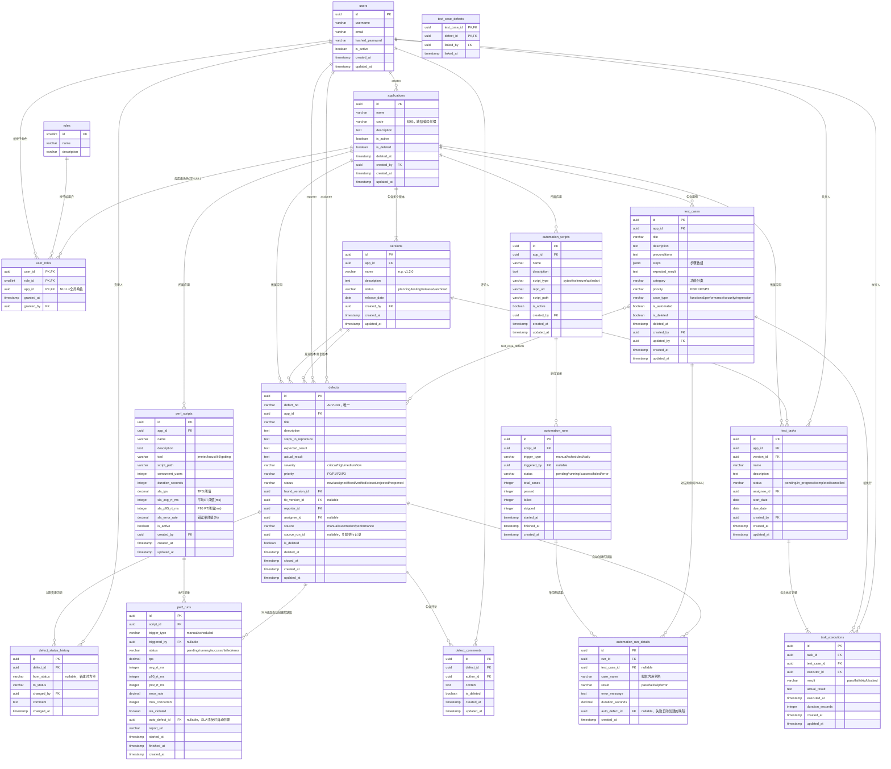

# test-center ER 图

日期：2026-06-05

> 使用 Mermaid erDiagram 语法，可在 Obsidian / VS Code (Markdown Preview Mermaid) / GitHub 直接渲染。

---

## 完整 ER 图



---

## 关键关系说明

### 1. 缺陷来源（source 字段）

```
task_executions (result=fail)  →  手工创建  →  defects (source=manual)
automation_run_details (fail)  →  自动创建  →  defects (source=automation)
perf_runs (sla_violated=true)  →  自动创建  →  defects (source=performance)
```

### 2. 用例与缺陷的多对多

```
一个 TestCase 可以关联多个 Defect（不同版本的相同 Bug）
一个 Defect 可以关联多个 TestCase（多条用例都触发了同一 Bug）
```

### 3. 角色权限范围

```
user_roles.app_id = NULL  →  全局角色（对所有应用生效）
user_roles.app_id = xxx   →  应用级角色（只对该应用生效）
```

### 4. 版本在缺陷中的两个外键

```
defects.found_version_id  →  在哪个版本发现的（必填）
defects.fix_version_id    →  在哪个版本修复的（NULL=未修复）
```
